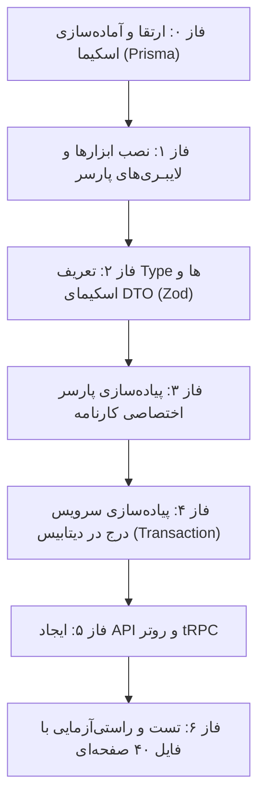

Viewed package.json:1-44
Viewed router.ts:1-60

برای پیاده‌سازی دقیق و اصولی این فرآیند در پروژه مکتبی، کار را به **۶ فاز تفکیک‌شده و منظم** تقسیم می‌کنیم. در هر مرحله، وظایف، فایل‌های درگیر و اقدامات لازم با تمام جزئیات مشخص شده‌اند:

---

---

### فاز ۰: ارتقا و هماهنگ‌سازی دیتابیس (`schema.prisma`)
در حال حاضر اسکیما آماده ساختارهای پایه است، اما چند فیلد برای نگهداری دقیق داده‌های کارنامه کم دارد:
1. **اطلاعات شناسنامه‌ای در `User` یا `Student`:**
   * افزودن `fatherName: String?` (نام پدر)
   * افزودن `birthDate: DateTime?` (تاریخ تولد)
   * افزودن `birthPlace: String?` (محل تولد)
   * افزودن `gender: String?` (پسر / دختر)
2. **پشتیبانی از نمره شایستگی پودمان در `Score`:**
   * در کارنامه، علاوه بر نمره عددی پودمان، سطح شایستگی کیفی («احراز شایستگی»، «بالاتر از حد انتظار»، «عدم احراز») ثبت شده است.
   * فیلد اختیاری `competencyLevel: String?` در جدول `Score`.
3. **اعمال مایگریشن:**
   * اجرای `pnpm db:migrate:dev` و `pnpm db:generate`.

---

### فاز ۱: راه‌اندازی وابستگی‌های پارسر متنی (بدون نیاز به هوش مصنوعی)
برای خواندن لایه متنی و ساختار جداول این PDF به صورت آفلاین و پرسرعت:
1. نصب کتابخانه پردازش لایه متنی PDF (مانند `pdfjs-dist` یا `unpdf`).
2. ساخت توابع کمکی (Helper Utils):
   * **`persian-normalize.ts`**: تبدیل ارقام فارسی و عربی (`۱۲.۷۵`) به ارقام انگلیسی استاندارد (`12.75`) و اصلاح کاراکترهای خاص (ی/ک/نیم‌فاصله‌ها).
   * **`bidi-fix.ts`**: برطرف کردن احتمال معکوس‌بودن رشته‌های فارسی در لایه متنی PDF (RTL reversal).

---

### فاز ۲: تعریف ساختار داده میانی (Data Transfer Objects - DTOs)
قبل از ریختن اطلاعات در دیتابیس، خروجی پارسر باید به تایپ‌های مشخص و اعتبارسنجی‌شده با **Zod** تبدیل شود:
* **`ReportCardSchoolDto`**: نام مدرسه، کد مدرسه، استان، منطقه، نوع، سال تحصیلی (`1404-1405`)، پایه (`دهم`)، کد رشته (`35101`).
* **`ReportCardStudentDto`**: کدملی، کد دانش‌آموزی، نام، نام خانوادگی، نام پدر، تاریخ تولد، جنسیت.
* **`ReportCardGradeDto`**:
  * کد درس، نام درس، تعداد واحد
  * نوع درس: نظری/عمومی یا پودمانی
  * نمرات عمومی: مستمر ۱، پایانی ۱، مستمر ۲، پایانی ۲، نمره نهایی سال
  * نمرات پودمانی: آرایه‌ای از ۵ پودمان (مستمر پودمان، نمره شایستگی کیفی، نمره عددی پودمان، وضعیت مردود/قبول).
* **`ReportCardSummaryDto`**: جمع نمرات، معدل سال، واحدهای اخذ شده (۴۲)، واحدهای قبولی (مثلاً ۴۲ یا ۴۰ یا ۳۴).

---

### فاز ۳: پیاده‌سازی الگوریتم پارسر کارنامه (`report-card.parser.ts`)
نوشتن کدی که فایل PDF را به عنوان بافر دریافت کرده و خروجی DTO تولید می‌کند:
1. **صفحه‌بندی دوصفحه‌ای:** تفکیک فایل به بسته‌های ۲ صفحه‌ای (چون هر کارنامه ۲ صفحه است؛ بنابراین فایل ۴۰ صفحه‌ای یعنی ۲۰ کارنامه).
2. **پارس هدر (Header Parser):** استخراج مشخصات مدرسه و هویت دانش‌آموز از بلوک بالای صفحه ۱.
3. **پارس جدول دروس (Table Parser):**
   * سطرهایی که ردیف عددی دارند و پیشوند `--` ندارند = درس اصلی.
   * سطرهایی که با `--` شروع می‌شوند = پودمان‌های درس قبلی.
4. **پارس خلاصه نتایج (Footer Parser):** استخراج معدل و جمع نمرات از جدول انتهای صفحه ۲.
5. **تست مجزا:** اجرای یک اسکریپت تست سریع (`scratch test`) روی فایل فعلی و بررسی خروجی JSON.

---

### فاز ۴: پیاده‌سازی سرویس درج در دیتابیس (`report-card-import.service.ts`)
این بخش عملیات درج را بر اساس تقدم کلیدهای خارجی و با منطق **`upsert`** انجام می‌دهد تا اگر یک فایل چند بار آپلود شد، دیتای تکراری نسازد:
1. **مرحله ۱ (مدرسه و تقویم):**
   * پیدا کردن یا ساختن `School`.
   * ساختن سال تحصیلی `AcademicYear` (عنوان: `۱۴۰۴-۱۴۰۵`) و ساخت `Term`های نوبت اول و دوم.
2. **مرحله ۲ (پایه، رشته و کلاس):**
   * ساخت `GradeLevel` (دهم) و `FieldOfStudy` (شبکه و نرم‌افزار).
   * ساخت کلاس درس پیش‌فرض در این سال تحصیلی (`SchoolClass`).
3. **مرحله ۳ (بانک دروس و پودمان‌ها):**
   * ساخت رکوردهای `Subject` (با تفکیک `theoretical` و `modular`).
   * برای دروس پودمانی: ساخت ۵ رکورد در `SubjectModule` با ایندکس ۱ تا ۵.
   * ثبت رکوردهای `Curriculum` (اتصال درس، رشته، پایه و تعداد واحدهای مصوب).
4. **مرحله ۴ (تخصیص دبیر و تعریف آزمون‌ها):**
   * ایجاد یک `Teacher` سیستمی برای مدرسه و انتساب به کلاس (`TeachingAssignment`).
   * ساخت آزمون‌ها در جدول `Exam`:
     * ۴ آزمون برای دروس عمومی.
     * آزمون‌های مستمر و شایستگی برای پودمان‌ها با اتصال به `subjectModuleId`.
5. **مرحله ۵ (دانش‌آموزان و نمرات):**
   * ساخت/آپدیت `User` با کدملی.
   * ساخت `UserSchool` و ساخت پروفایل `Student`.
   * ثبت‌نام در کلاس (`Enrollment`).
   * درج نمرات تک‌تک دروس و پودمان‌ها در `Score`.
6. **مدیریت تراکنش:** کل عملیات برای هر دانش‌آموز (یا کل فایل) داخل یک `prisma.$transaction` اجرا می‌شود تا در صورت بروز خطا، داده‌ها Rollback شوند.

---

### فاز ۵: ایجاد API در لایه tRPC (`src/modules/importers/router.ts`)
* ایجاد ماژول جدید `importers` در پوشه ماژول‌های پروژه.
* ساخت روتر tRPC شامل پروسیجر:
  * `importReportCardPdf`: دریافت فایل به صورت base64 یا multipart.
  * `dryRunReportCard`: قابلیت پیش‌نمایش اطلاعات استخراج‌شده قبل از درج نهایی در دیتابیس (برای تأیید کاربر).
* اتصال به سیستم مجوزها (RBAC): دسترسی محدود به `superAdmin` یا مدیر/معاون مدرسه.
* ثبت لاگ در `AuditLog`.

---

### فاز ۶: تست نهایی، راستی‌آزمایی و اعتبارسنجی
1. اجرای فایل ۴۰ صفحه‌ای نمونه روی دیتابیس تستی/لوکال.
2. بررسی ثبت دقیق تمامی ۲۰ دانش‌آموز با کدملی‌هایشان.
3. بررسی نمرات دانش‌آموزان با وضعیت خاص (مثلاً مهیار ترکیان که پودمان‌های ۳ و ۴ ریاضی او مردود است و درس ناتمام خورده است).
4. بررسی عدم ثبت داده تکراری در صورت اجرای مجدد (Idempotency).

---

### نقطه شروع:
اگر موافق باشید، گام اول را از **«فاز ۰: بررسی و افزودن فیلدهای لازم به `schema.prisma`»** شروع کنیم. تایید می‌فرمایید؟