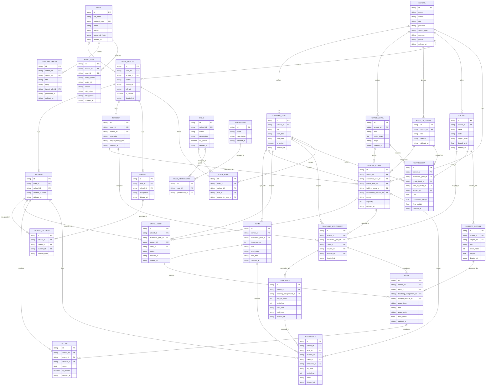

## نمودار

---

## موجودیت ها

### ACADEMIC_YEAR (سال تحصیلی)
**هدف:** ریشه‌ی زمانی همه‌چیز. هر داده‌ای که «هر سال از نو شروع می‌شود» به این وصل است.

**فیلدها:** `title` (مثلاً `۱۴۰۴-۱۴۰۵`)، `start_date`، `end_date`، `is_active`.
**قید:** `UNIQUE (school_id, title)` و حداکثر یک ردیف با `is_active = true` در هر مدرسه (با partial unique index).
**چرا مستقل و نه فقط یک رشته‌ی `academic_year` روی هر جدول؟** چون سال تحصیلی خودش داده دارد (تاریخ شروع/پایان، فعال بودن) و اگر رشته باشد، `"۱۴۰۴-۱۴۰۵"` و `"1404-1405"` و `"۱۴۰۴/۱۴۰۵"` بالاخره در دیتابیس با هم قاطی می‌شوند.

### TERM (نوبت)
**هدف:** نوبت اول و نوبت دوم.
**فیلدها:** `term_number` (۱ یا ۲)، `title`، `start_date`، `end_date`.
**قید:** `UNIQUE (academic_year_id, term_number)`.
**نکته:** `term_number` را `int` گرفتم نه enum، چون بعضی مدارس (یا دوره‌های تابستانی/شهریور) نوبت سوم دارند. اگر می‌خواهی سخت‌گیر باشی: `CHECK (term_number IN (1,2))`.

### GRADE_LEVEL (پایه)
**هدف:** پایه‌های تعریف‌شده در هر مدرسه — هفتم/هشتم/نهم یا دهم/یازدهم/دوازدهم.
**فیلدها:** `title` («دهم»)، `order_index` (۱۰ — برای مرتب‌سازی و ارتقای پایه)، `stage` (`middle_school` / `high_school`).
**چرا `order_index` عددی؟** برای «ارتقای پایه» در پایان سال: `next_level = order_index + 1`. با رشته‌ی «دهم» نمی‌شود این را حساب کرد.

### FIELD_OF_STUDY (رشته)
**هدف:** ریاضی-فیزیک، تجربی، انسانی، یا رشته‌های فنی‌وحرفه‌ای (کامپیوتر، حسابداری، ...).
**فیلدها:** `title`، `branch` (`theoretical` / `technical` / `vocational`).
**چرا اضافه‌اش کردم؟** تو خواستی درس‌ها پودمانی یا تئوری باشند. درس پودمانی فقط در شاخه‌ی فنی‌وحرفه‌ای و کاردانش معنی دارد. بدون رشته، نمی‌شود گفت «کدام کلاس‌ها اصلاً درس پودمانی دارند». ضمناً `SCHOOL_CLASS.name = "دهم ریاضی-۱"` در نسخه‌ی قبلی داشت رشته را داخل رشته‌متن قایم می‌کرد.
**اگر پروژه فقط نظری است:** می‌توانی این جدول را حذف کنی و FK هایش را بیندازی — بقیه مدل بدون آن هم کار می‌کند.

### ENROLLMENT (ثبت‌نام سالانه)
**هدف:** «دانش‌آموز X در سال Y در کلاس Z است».
**فیلدها:** `student_id`، `class_id`، `academic_year_id`، `status` (`active` / `transferred` / `graduated` / `dropped`).
**قید:** `UNIQUE (student_id, academic_year_id)` — یک دانش‌آموز در هر سال فقط در یک کلاس.
**چرا `class_id` را از `STUDENT` بیرون آوردم؟** خودت گفتی «هر دانش‌آموز شامل سال تحصیلی است». اگر `class_id` روی `STUDENT` بماند، وقتی دانش‌آموز از دهم به یازدهم می‌رود یا باید رکورد دانش‌آموز را overwrite کنی (تاریخچه از بین می‌رود) یا برای هر سال یک `STUDENT` جدید بسازی (که یعنی یک آدم، چند هویت). `ENROLLMENT` هر دو مشکل را حل می‌کند: `STUDENT` هویت دائمی است، `ENROLLMENT` وضعیت سالانه.

### TEACHING_ASSIGNMENT (تخصیص تدریس)
**هدف:** پاسخ مستقیم به «هر معلمی می‌تواند چندین `school_class` داشته باشد». این جدول واسط سه‌طرفه‌ی معلم ↔ کلاس ↔ درس در یک سال تحصیلی است.
**فیلدها:** `academic_year_id`، `class_id`، `subject_id`، `teacher_id`.
**قید:** `UNIQUE (class_id, subject_id, academic_year_id)` — هر درس در هر کلاس یک معلم مسئول دارد. (اگر تدریس مشترک می‌خواهی، `teacher_id` را هم به کلید یکتا اضافه کن.)
**چرا این ساختاری‌ترین تغییر این نسخه است:** در v4، سه‌تایی (کلاس، درس، معلم) هم در `TIMETABLE` بود هم به‌طور ضمنی در `EXAM`. یعنی داده تکراری و امکان تناقض — می‌شد امتحانی ساخت که معلمش با معلم برنامه هفتگی فرق داشته باشد. حالا `TIMETABLE` و `EXAM` هر دو به یک `TEACHING_ASSIGNMENT` اشاره می‌کنند و منبع حقیقت یکی است.

**سه سؤالی که این جدول یک‌خطی جواب می‌دهد:**
- کلاس‌های یک معلم: `WHERE teacher_id = ?`
- معلم‌های یک کلاس: `WHERE class_id = ?`
- کارنامه‌ی یک درس در یک کلاس: از اینجا به `EXAM` و `SCORE`

### CURRICULUM (برنامه درسی پایه)
**هدف:** جایی که «واحد» (ضریب) می‌نشیند: «ریاضی در پایه دهمِ رشته ریاضی، ۴ واحد است».
**فیلدها:** `grade_level_id`، `field_of_study_id`، `subject_id`، `academic_year_id`، `unit`، `continuous_weight`، `final_weight`.
**قید:** `UNIQUE (academic_year_id, grade_level_id, field_of_study_id, subject_id)`.
**چرا واحد اینجاست و نه روی `SUBJECT`؟** چون ضریب ریاضی در دهم با یازدهم فرق می‌کند و در رشته‌ی انسانی با ریاضی هم فرق می‌کند. `SUBJECT.default_unit` را نگه داشتم به‌عنوان مقدار پیش‌فرض هنگام ساختن `CURRICULUM`، ولی **مرجع معدل‌گیری `CURRICULUM.unit` است**.
**اگر ساده‌تر می‌خواهی:** `CURRICULUM` را حذف کن و فقط `SUBJECT.unit` را نگه دار. کار می‌کند، ولی روزی که یک درس در دو پایه ضریب متفاوت داشته باشد، مجبوری دو رکورد `SUBJECT` بسازی.

**`continuous_weight` / `final_weight` چیست؟** ضریب ترکیب مستمر و پایانی برای رسیدن به نمره‌ی نوبت. مثلاً `5` و `15` (یعنی مستمر از ۵، پایانی از ۱۵) یا `0.5` و `0.5`. چون این سیاست بین مدارس و دوره‌ها فرق می‌کند، بهتر است داده باشد نه ثابتِ hard-coded در کد.

### SUBJECT_MODULE (پودمان)
**هدف:** درس پودمانی از چند پودمان تشکیل شده و هر پودمان نمره‌ی مستقل دارد.
**فیلدها:** `subject_id`، `title`، `order_index`، `weight`.
**قاعده:** فقط برای `SUBJECT.subject_type = 'modular'` رکورد دارد. برای درس تئوری، `EXAM.subject_module_id` باید `NULL` باشد. این را در لایه اپلیکیشن یا با یک `CHECK` ترکیبی اعتبارسنجی کن.

### USER_SCHOOL (عضویت کاربر در مدرسه)
**هدف:** معلم‌ها در ایران معمولاً در چند مدرسه تدریس می‌کنند و دانش‌آموز هم ممکن است وسط سال منتقل شود. با `USER.school_id`، همان آدم مجبور بود دو حساب کاربری، دو رمز عبور و دو ایمیل داشته باشد.
**فیلدها:** `user_id`، `school_id`، `status` (`active` / `inactive` / `left`)، `joined_at`، `left_at`، `is_default`.
**قید:** `UNIQUE (user_id, school_id)`.
**`is_default` چیست؟** وقتی کاربر وارد سیستم می‌شود و در چند مدرسه عضو است، این تعیین می‌کند کدام مدرسه پیش‌فرض باز شود. حداکثر یک ردیف `true` به‌ازای هر `user_id` (partial unique index).

**این جدول ریشه‌ی مستأجری (tenancy) شد.** یعنی هر چیزی که کاربر را به یک مدرسه وصل می‌کند — نقش، پروفایل دانش‌آموزی، پروفایل معلمی — باید از یک عضویت معتبر عبور کند، نه مستقیم از `USER`.

---

## سناریوی نمونه

«هنرستان فرهنگ»، ناحیه ۴، سال تحصیلی ۱۴۰۴-۱۴۰۵، با یک کلاس نظری و یک کلاس فنی (برای نشان دادن درس پودمانی).

### SCHOOL
| id | name | district | city | school_type |
|---|---|---|---|---|
| school_1 | هنرستان فرهنگ | ناحیه ۴ | تهران | technical |
| school_2 | دبیرستان دانش | ناحیه ۲ | تهران | high_school |

### USER
*هویت سراسری — بدون `school_id`.*

| id | full_name | national_code | email |
|---|---|---|---|
| user_1 | علی محمدی | 0079xxxxxx | ali@example.ir |
| user_3 | رضا کریمی | 0064xxxxxx | reza@example.ir |
| user_4 | مریم حسینی | 0155xxxxxx | maryam@example.ir |

### USER_SCHOOL
*نکته کلیدی: `user_3` (رضا کریمی) در دو مدرسه تدریس می‌کند — یک حساب کاربری، یک رمز عبور، دو عضویت

| id | user_id | school_id | status | is_default |
|---|---|---|---|---|
| us_1 | user_1 | school_1 | active | true |
| us_2 | user_3 | school_1 | active | true |
| us_3 | user_3 | school_2 | active | false |
| us_4 | user_4 | school_1 | active | true |

### TEACHER
*دو پروفایل جدا برای یک نفر — چون نوع استخدامش در دو مدرسه فرق می‌کند.*

| id | user_id | school_id | specialty | employment_type |
|---|---|---|---|---|
| teacher_1 | user_3 | school_1 | ریاضی | رسمی |
| teacher_9 | user_3 | school_2 | ریاضی | حق‌التدریس |

### USER_ROLE
| id | user_id | school_id | role_id | academic_year_id |
|---|---|---|---|---|
| ur_1 | user_1 | school_1 | role_principal | null |
| ur_2 | user_3 | school_1 | role_teacher | ay_1404 |
| ur_3 | user_3 | school_2 | role_teacher | ay_1404 |
| ur_4 | user_4 | school_1 | role_student | ay_1404 |

### ACADEMIC_YEAR
| id | school_id | title | start_date | end_date | is_active |
|---|---|---|---|---|---|
| ay_1404 | school_1 | ۱۴۰۴-۱۴۰۵ | ۱۴۰۴/۰۷/۰۱ | ۱۴۰۵/۰۳/۳۱ | true |
| ay_1403 | school_1 | ۱۴۰۳-۱۴۰۴ | ۱۴۰۳/۰۷/۰۱ | ۱۴۰۴/۰۳/۳۱ | false |

### TERM
| id | academic_year_id | term_number | title | start_date | end_date |
|---|---|---|---|---|---|
| term_1 | ay_1404 | 1 | نوبت اول | ۱۴۰۴/۰۷/۰۱ | ۱۴۰۴/۱۰/۳۰ |
| term_2 | ay_1404 | 2 | نوبت دوم | ۱۴۰۴/۱۱/۰۱ | ۱۴۰۵/۰۳/۳۱ |

### GRADE_LEVEL
| id | school_id | title | order_index | stage |
|---|---|---|---|---|
| gl_10 | school_1 | دهم | 10 | high_school |
| gl_11 | school_1 | یازدهم | 11 | high_school |
| gl_12 | school_1 | دوازدهم | 12 | high_school |

### FIELD_OF_STUDY
| id | school_id | title | branch |
|---|---|---|---|
| fos_math | school_1 | ریاضی-فیزیک | theoretical |
| fos_computer | school_1 | شبکه و نرم‌افزار رایانه | technical |

### SUBJECT
| id | school_id | name | code | subject_type | default_unit |
|---|---|---|---|---|---|
| subj_math | school_1 | ریاضی | MATH | theoretical | 4 |
| subj_physics | school_1 | فیزیک | PHY | theoretical | 3 |
| subj_network | school_1 | نصب و راه‌اندازی سیستم‌های رایانه‌ای | NET | modular | 8 |

### SUBJECT_MODULE
| id | subject_id | title | order_index | weight |
|---|---|---|---|---|
| mod_1 | subj_network | پودمان ۱: مونتاژ رایانه | 1 | 1 |
| mod_2 | subj_network | پودمان ۲: نصب سیستم‌عامل | 2 | 1 |
| mod_3 | subj_network | پودمان ۳: شبکه محلی | 3 | 1 |

### CURRICULUM
| id | academic_year_id | grade_level_id | field_of_study_id | subject_id | unit | continuous_weight | final_weight |
|---|---|---|---|---|---|---|---|
| cur_1 | ay_1404 | gl_10 | fos_math | subj_math | 4 | 0.25 | 0.75 |
| cur_2 | ay_1404 | gl_10 | fos_math | subj_physics | 3 | 0.25 | 0.75 |
| cur_3 | ay_1404 | gl_10 | fos_computer | subj_math | 2 | 0.25 | 0.75 |
| cur_4 | ay_1404 | gl_10 | fos_computer | subj_network | 8 | 0.50 | 0.50 |

*توجه: `cur_1` و `cur_3` — ریاضی در رشته‌ی ریاضی ۴ واحد است و در رشته‌ی کامپیوتر ۲ واحد. این دقیقاً دلیلِ وجود `CURRICULUM` است.*

### SCHOOL_CLASS
| id | academic_year_id | grade_level_id | field_of_study_id | homeroom_teacher_id | name | capacity |
|---|---|---|---|---|---|---|
| class_1 | ay_1404 | gl_10 | fos_math | teacher_1 | دهم ریاضی ۱ | 30 |
| class_2 | ay_1404 | gl_10 | fos_computer | teacher_2 | دهم کامپیوتر ۱ | 25 |

### TEACHING_ASSIGNMENT
*نکته: `teacher_1` (رضا کریمی) در دو کلاس تدریس می‌کند — پاسخ به «هر معلم چند `school_class` دارد».*

| id | academic_year_id | class_id | subject_id | teacher_id |
|---|---|---|---|---|
| ta_1 | ay_1404 | class_1 | subj_math | teacher_1 |
| ta_2 | ay_1404 | class_2 | subj_math | teacher_1 |
| ta_3 | ay_1404 | class_1 | subj_physics | teacher_2 |
| ta_4 | ay_1404 | class_2 | subj_network | teacher_3 |

### ENROLLMENT
| id | academic_year_id | student_id | class_id | status |
|---|---|---|---|---|
| enr_1 | ay_1404 | student_1 | class_1 | active |
| enr_2 | ay_1404 | student_2 | class_2 | active |
| enr_0 | ay_1403 | student_1 | class_old_9 | graduated |

*نکته: `student_1` رکورد سال قبلش هم مانده — تاریخچه‌ی تحصیلی کامل بدون تکرار هویت.*

### EXAM
| id | term_id | teaching_assignment_id | subject_module_id | exam_type | title | exam_date | max_score |
|---|---|---|---|---|---|---|---|
| exam_1 | term_1 | ta_1 | null | continuous | مستمر ریاضی مهر | ۱۴۰۴/۰۷/۲۵ | 20 |
| exam_2 | term_1 | ta_1 | null | continuous | مستمر ریاضی آبان | ۱۴۰۴/۰۸/۲۰ | 20 |
| exam_3 | term_1 | ta_1 | null | term_final | امتحان پایانی نوبت اول ریاضی | ۱۴۰۴/۱۰/۱۵ | 20 |
| exam_4 | term_1 | ta_4 | mod_1 | term_final | ارزشیابی پودمان ۱ | ۱۴۰۴/۰۹/۱۰ | 20 |
| exam_5 | term_2 | ta_1 | null | national_final | امتحان نهایی ریاضی | ۱۴۰۵/۰۳/۱۰ | 20 |

### SCORE
| id | exam_id | student_id | score | is_absent |
|---|---|---|---|---|
| score_1 | exam_1 | student_1 | ۱۷ | false |
| score_2 | exam_2 | student_1 | ۱۸ | false |
| score_3 | exam_3 | student_1 | ۱۹ | false |
| score_4 | exam_4 | student_2 | null | true |

